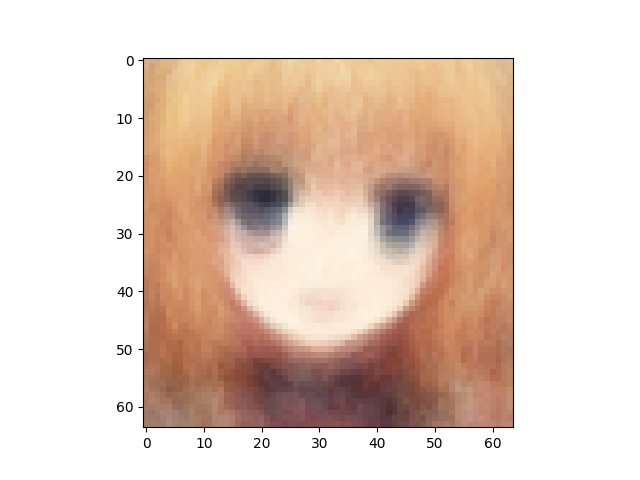
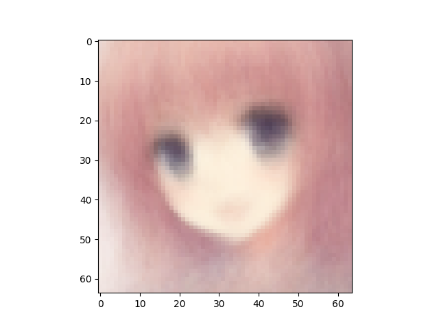
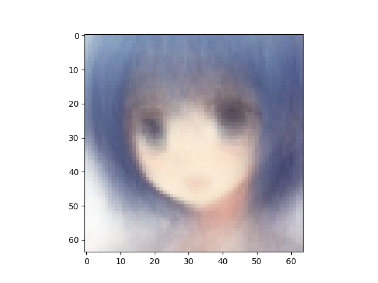
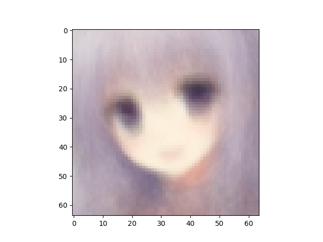
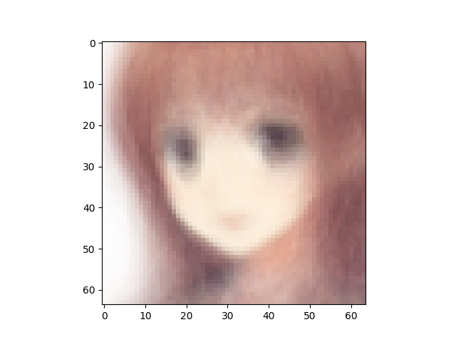
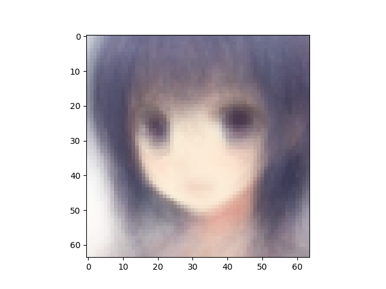
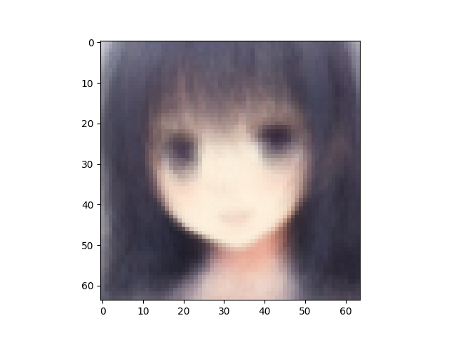
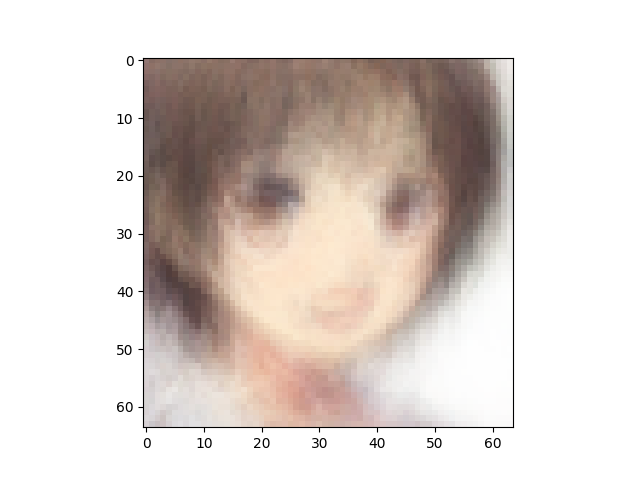
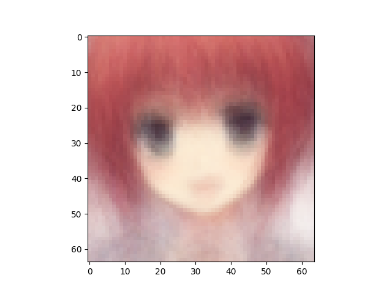

Number of latent variables 	5

Number of hidden layers 	5

Number of hidden nodes per layer 	400

Number of epochs trained 	40

Epoch0, Training loss 9237.8886718750, Time used 2.26

Epoch1, Training loss 7057.5737304688, Time used 2.17

Epoch2, Training loss 6995.0278320312, Time used 2.16

Epoch3, Training loss 6938.8388671875, Time used 2.19

Epoch4, Training loss 6902.3232421875, Time used 2.15

Epoch5, Training loss 6872.6762695312, Time used 2.15

Epoch6, Training loss 6844.2573242188, Time used 2.14

Epoch7, Training loss 6834.3945312500, Time used 2.14

Epoch8, Training loss 6827.2866210938, Time used 2.14

Epoch9, Training loss 6823.4335937500, Time used 2.15

Epoch10, Training loss 6817.2109375000, Time used 2.14

Epoch11, Training loss 6813.2622070312, Time used 2.14

Epoch12, Training loss 6808.5883789062, Time used 2.14

Epoch13, Training loss 6805.8603515625, Time used 2.14

Epoch14, Training loss 6804.3823242188, Time used 2.14

Epoch15, Training loss 6800.4926757812, Time used 2.14

Epoch16, Training loss 6797.4462890625, Time used 2.14

Epoch17, Training loss 6793.9150390625, Time used 2.14

Epoch18, Training loss 6794.3681640625, Time used 2.14

Epoch19, Training loss 6790.1650390625, Time used 2.14

Epoch20, Training loss 6786.9536132812, Time used 2.14

Epoch21, Training loss 6786.4853515625, Time used 2.14

Epoch22, Training loss 6782.3256835938, Time used 2.14

Epoch23, Training loss 6782.5737304688, Time used 2.14

Epoch24, Training loss 6781.0102539062, Time used 2.14

Epoch25, Training loss 6775.4667968750, Time used 2.14

Epoch26, Training loss 6776.2099609375, Time used 2.14

Epoch27, Training loss 6772.5703125000, Time used 2.14

Epoch28, Training loss 6768.6923828125, Time used 2.14

Epoch29, Training loss 6767.2641601562, Time used 2.14

Epoch30, Training loss 6768.0375976562, Time used 2.14

Epoch31, Training loss 6764.4550781250, Time used 2.14

Epoch32, Training loss 6761.3261718750, Time used 2.14

Epoch33, Training loss 6761.3149414062, Time used 2.14

Epoch34, Training loss 6758.2060546875, Time used 2.14

Epoch35, Training loss 6755.5400390625, Time used 2.15

Epoch36, Training loss 6753.2167968750, Time used 2.11

Epoch37, Training loss 6757.6132812500, Time used 2.11

Epoch38, Training loss 6750.2084960938, Time used 2.11

Epoch39, Training loss 6749.3408203125, Time used 2.11

