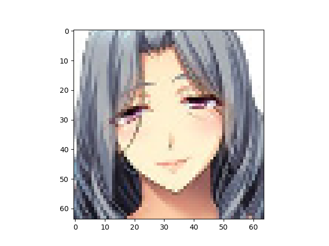
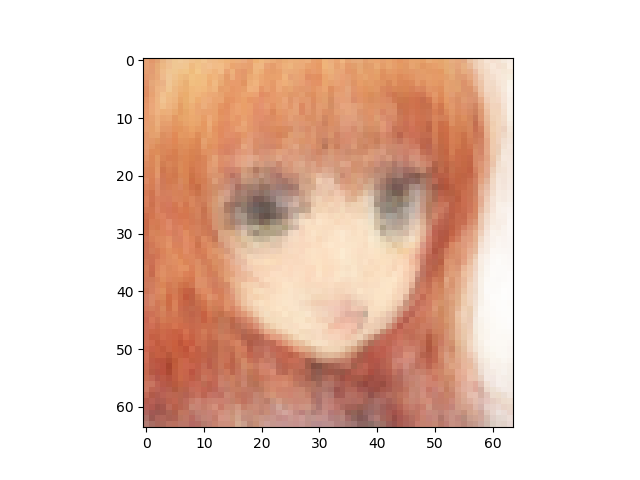

Number of latent variables 	5

Number of hidden layers 	5

Number of hidden nodes per layer 	400

Number of epochs trained 	50

Epoch0, Training loss 7303.0878906250, Time used 2.21

Epoch1, Training loss 7037.6767578125, Time used 2.11

Epoch2, Training loss 6970.8833007812, Time used 2.18

Epoch3, Training loss 6906.7333984375, Time used 2.19

Epoch4, Training loss 6850.9687500000, Time used 2.17

Epoch5, Training loss 6833.4028320312, Time used 2.11

Epoch6, Training loss 6822.8271484375, Time used 2.18

Epoch7, Training loss 6812.5380859375, Time used 2.11

Epoch8, Training loss 6806.3579101562, Time used 2.10

Epoch9, Training loss 6801.0581054688, Time used 2.10

Epoch10, Training loss 6799.7924804688, Time used 2.10

Epoch11, Training loss 6794.5229492188, Time used 2.19

Epoch12, Training loss 6790.7055664062, Time used 2.16

Epoch13, Training loss 6788.3510742188, Time used 2.17

Epoch14, Training loss 6782.7641601562, Time used 2.16

Epoch15, Training loss 6780.3017578125, Time used 2.16

Epoch16, Training loss 6778.0000000000, Time used 2.17

Epoch17, Training loss 6780.9790039062, Time used 2.36

Epoch18, Training loss 6775.1513671875, Time used 2.19

Epoch19, Training loss 6776.5175781250, Time used 2.18

Epoch20, Training loss 6771.3359375000, Time used 2.19

Epoch21, Training loss 6768.5673828125, Time used 2.18

Epoch22, Training loss 6763.2109375000, Time used 2.18

Epoch23, Training loss 6763.5439453125, Time used 2.19

Epoch24, Training loss 6760.9843750000, Time used 2.19

Epoch25, Training loss 6762.9028320312, Time used 2.25

Epoch26, Training loss 6754.3046875000, Time used 2.25

Epoch27, Training loss 6756.3325195312, Time used 2.19

Epoch28, Training loss 6751.5498046875, Time used 2.20

Epoch29, Training loss 6750.7402343750, Time used 2.20

Epoch30, Training loss 6749.8647460938, Time used 2.20

Epoch31, Training loss 6747.2846679688, Time used 2.20

Epoch32, Training loss 6744.4111328125, Time used 2.22

Epoch33, Training loss 6744.2573242188, Time used 2.20

Epoch34, Training loss 6742.9438476562, Time used 2.19

Epoch35, Training loss 6742.3793945312, Time used 2.20

Epoch36, Training loss 6735.4189453125, Time used 2.19

Epoch37, Training loss 6741.8618164062, Time used 2.19

Epoch38, Training loss 6735.1689453125, Time used 2.25

Epoch39, Training loss 6733.2636718750, Time used 2.21

Epoch40, Training loss 6734.1582031250, Time used 2.20

Epoch41, Training loss 6729.6030273438, Time used 2.21

Epoch42, Training loss 6733.7973632812, Time used 2.24

Epoch43, Training loss 6731.4531250000, Time used 2.23

Epoch44, Training loss 6723.3471679688, Time used 2.28

Epoch45, Training loss 6720.0332031250, Time used 2.30

Epoch46, Training loss 6724.4648437500, Time used 2.13

Epoch47, Training loss 6723.2021484375, Time used 2.14

Epoch48, Training loss 6720.8525390625, Time used 2.13

Epoch49, Training loss 6723.7705078125, Time used 2.14

